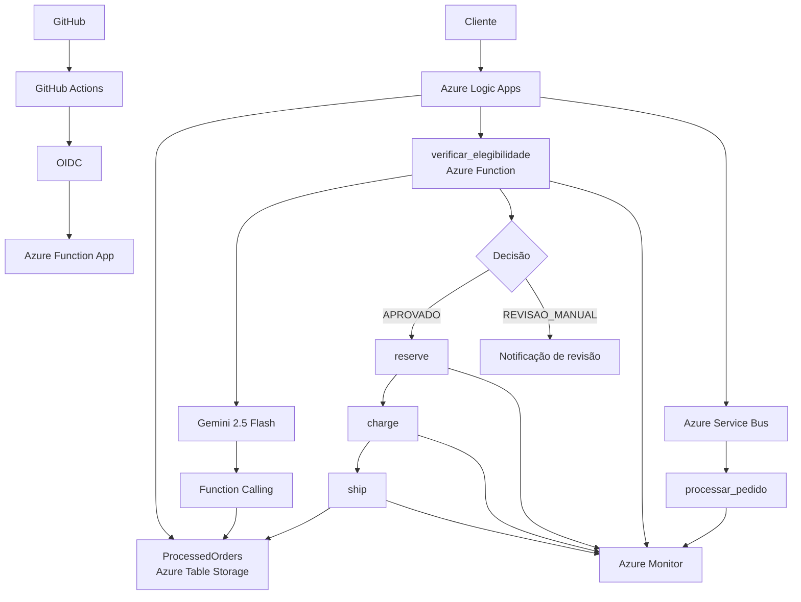

# Projeto Final — Arquitetura Serverless Event-Driven com IA

## 1. Visão geral

Este projeto apresenta uma arquitetura **serverless, orientada a eventos e integrada a Inteligência Artificial**, utilizando serviços da Microsoft Azure.

A solução processa pedidos de forma assíncrona, verifica a elegibilidade do cliente com apoio de IA, executa as etapas de reserva, cobrança e envio e registra os pedidos processados.

O projeto também implementa **idempotência, observabilidade e CI/CD com autenticação OIDC**.

---

## 2. Arquitetura



---

## 3. Componentes

### Azure Functions

As Azure Functions implementam as principais unidades de processamento:

* `verificar_elegibilidade`: integração com o modelo de IA;
* `reserve`: reserva;
* `charge`: cobrança;
* `ship`: envio;
* `processar_pedido`: processamento assíncrono e controle de idempotência.

A utilização de Functions permite executar cada responsabilidade de forma independente, sem gerenciamento de servidores.

### Azure Logic Apps

A Logic App realiza a **orquestração do fluxo principal**:

1. verifica se o pedido já foi processado;
2. consulta a elegibilidade;
3. executa reserva, cobrança e envio quando aprovado;
4. encaminha pedidos para revisão manual quando necessário;
5. registra o pedido processado.

### Azure Service Bus

O Service Bus é utilizado para comunicação assíncrona por meio da fila `orders`.

Ele reduz o acoplamento entre o produtor e o consumidor e permite que o processamento ocorra de forma independente.

### Azure Table Storage

A tabela `ProcessedOrders` armazena os pedidos processados e o histórico utilizado pela solução.

Ela também é utilizada para controle de **idempotência**.

---

## 4. Orquestração e eventos

A arquitetura combina dois padrões de comunicação.

A **Logic App utiliza orquestração** porque reserva, cobrança e envio possuem uma ordem e dependências claras. Por exemplo, a cobrança só deve ocorrer após a reserva ser concluída com sucesso.

Já o **Service Bus utiliza comunicação assíncrona** para desacoplar o recebimento do pedido do seu processamento.

Assim, cada abordagem é utilizada de acordo com a necessidade do fluxo, evitando tanto a centralização excessiva quanto o acoplamento entre serviços.

---

## 5. Decisões técnicas

| Decisão                                            | Justificativa                                                                                                                                                   |
| -------------------------------------------------- | --------------------------------------------------------------------------------------------------------------------------------------------------------------- |
| **Azure Functions**                                | Permitem separar as responsabilidades em funções independentes e executar o processamento sem gerenciamento de servidores.                                      |
| **Logic Apps para orquestração**                   | O fluxo de reserva, cobrança e envio possui uma sequência definida e dependências entre etapas. A orquestração centralizada facilita o controle desse processo. |
| **Azure Service Bus**                              | Utilizado para comunicação assíncrona e desacoplamento entre o recebimento e o processamento dos pedidos.                                                       |
| **Azure Table Storage**                            | Armazena o histórico dos pedidos e permite verificar se um `order_id` já foi processado, garantindo idempotência.                                               |
| **IA + Function Calling**                          | Permite que o modelo utilize informações do histórico do cliente durante a decisão de elegibilidade, em vez de analisar somente os dados do pedido atual.       |
| **Azure Monitor / Application Insights**           | Fornecem observabilidade sobre a execução das Functions e permitem investigar erros e operações realizadas.                                                     |
| **GitHub Actions + OIDC**                          | Automatizam o deploy e evitam a necessidade de armazenar credenciais permanentes do Azure no GitHub.                                                            |
| **Separação entre revisão manual e falha técnica** | Uma decisão de negócio (`REVISAO_MANUAL`) não é tratada como erro técnico, permitindo comportamentos diferentes para cada situação.                             |

---

## 6. Integração com IA

A Function `verificar_elegibilidade` utiliza o **Gemini 2.5 Flash** para analisar o pedido.

A integração utiliza **function calling**, permitindo que o modelo consulte o histórico do cliente armazenado em `ProcessedOrders`.

A lógica considera:

* mais de 3 pedidos para o mesmo cliente → `REVISAO_MANUAL`;
* valor superior a R$ 5.000 → `REVISAO_MANUAL`;
* demais situações → `APROVADO`.

Quando aprovado, o fluxo continua para reserva, cobrança e envio. Quando é necessária revisão, o processamento automático é interrompido e uma notificação é gerada.

A chave da API é fornecida por variável de ambiente e não é armazenada no repositório.

---

## 7. Idempotência

Antes de processar um pedido, a solução consulta `ProcessedOrders` utilizando o `order_id`.

Caso o pedido já exista, o fluxo não executa novamente as etapas de reserva, cobrança e envio.

Esse mecanismo evita processamento duplicado, um cenário importante em arquiteturas distribuídas e orientadas a eventos.

---

## 8. Observabilidade

A solução utiliza **Azure Monitor, Application Insights e Log Analytics**.

As Functions registram eventos estruturados contendo informações como:

* operação;
* `order_id`;
* status;
* tipo e mensagem de erro, quando aplicável.

Isso permite acompanhar a execução e investigar falhas nos diferentes componentes da arquitetura.

---

## 9. CI/CD

O projeto utiliza **GitHub Actions** para automatizar o deploy da aplicação.

A autenticação entre GitHub e Azure utiliza **OIDC (OpenID Connect)**, evitando o armazenamento de credenciais permanentes no repositório.

Fluxo:

```text
GitHub
   ↓
GitHub Actions
   ↓
Azure Login via OIDC
   ↓
Deploy
   ↓
Azure Function App
```

---

## 10. Segurança

O projeto segue as seguintes práticas:

* nenhuma API key é versionada;
* credenciais do Azure não são armazenadas no repositório;
* arquivos `.env` e configurações locais com segredos não fazem parte da entrega;
* a integração com IA utiliza variável de ambiente;
* o pipeline utiliza OIDC;
* o endpoint ativo da Function App não é exposto no README.

---

## 11. Testes realizados

Foram realizados testes dos principais comportamentos da solução.

### Fluxo aprovado

Um pedido aprovado percorreu com sucesso:

```text
Elegibilidade → Reserva → Cobrança → Envio → Registro
```

### Revisão manual

Um pedido acima do limite definido foi direcionado para revisão manual, sem executar as etapas de reserva, cobrança e envio.

### Idempotência

Um pedido já processado foi enviado novamente.

A existência do pedido foi identificada e as etapas de processamento não foram executadas novamente.

---

## 12. Conclusão

A arquitetura combina **serverless, eventos, orquestração e Inteligência Artificial** para criar um fluxo distribuído e desacoplado.

As principais decisões foram utilizar:

* **Logic Apps** para orquestrar processos com sequência definida;
* **Service Bus** para comunicação assíncrona e desacoplamento;
* **Functions** para separar responsabilidades de processamento;
* **IA + Function Calling** para apoiar a decisão de elegibilidade utilizando dados do sistema;
* **Table Storage** para histórico e idempotência;
* **Azure Monitor** para observabilidade;
* **GitHub Actions + OIDC** para automação e segurança no CI/CD.

O projeto consolida esses componentes em uma arquitetura serverless orientada a eventos, com mecanismos de segurança, observabilidade e controle de processamento.
